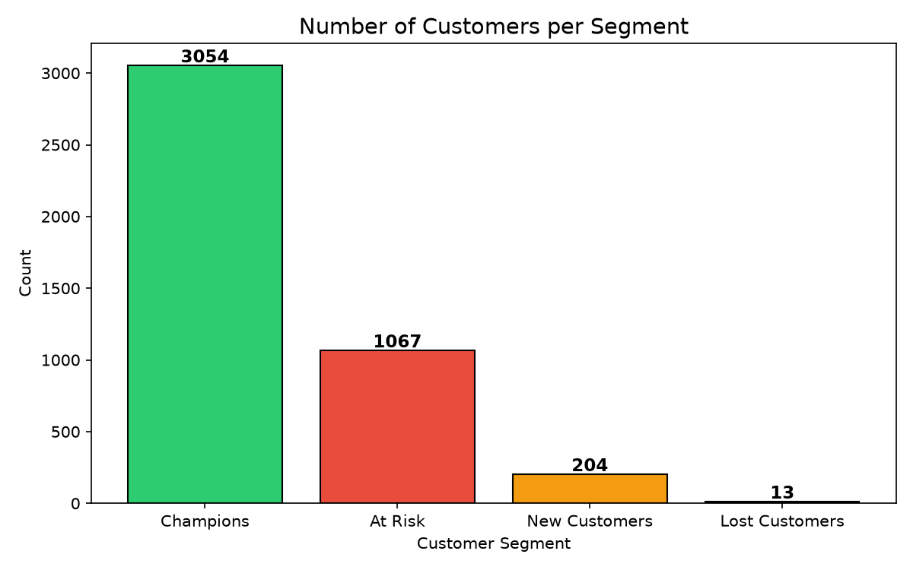
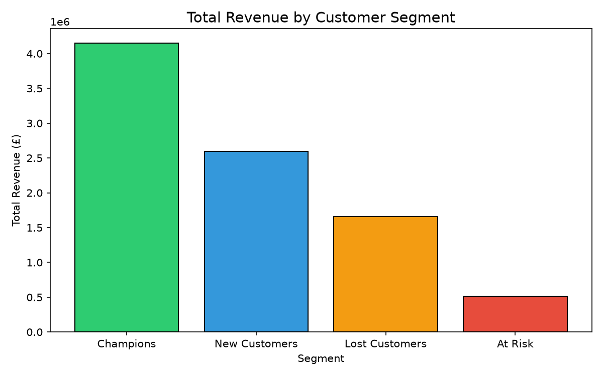
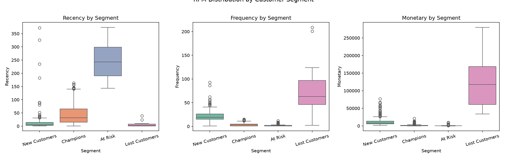
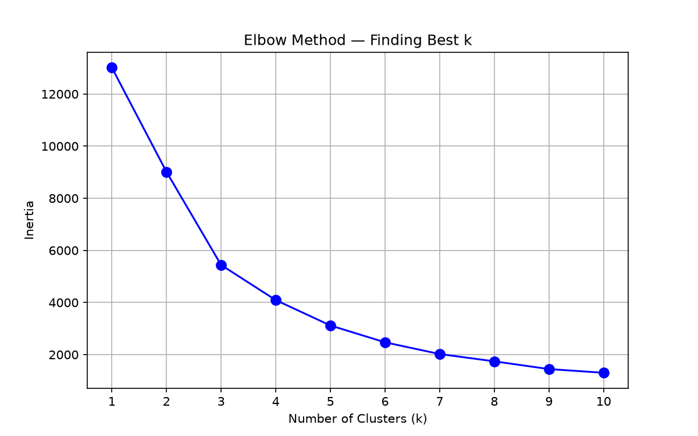
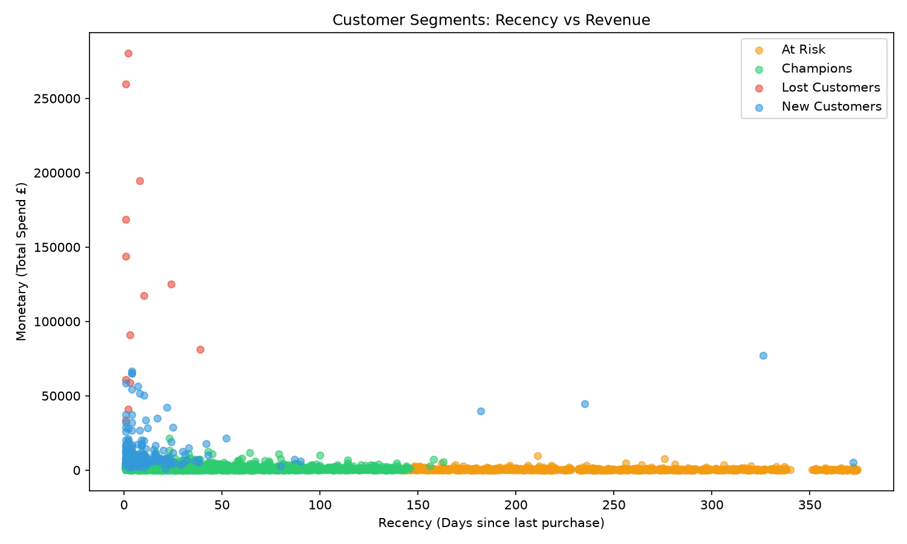

# 🛒 Customer Segmentation using RFM Analysis & K-Means Clustering

## 📌 Overview
Analyzed **541,909 retail transactions** from a UK-based online store 
to segment 4,300+ customers into behavioral groups using Python. 
This helps businesses identify high-value customers and build 
smarter marketing strategies.

## 🛠️ Tools & Technologies
- **Language:** Python 3
- **Libraries:** Pandas, NumPy, Scikit-learn, Matplotlib, Seaborn
- **Environment:** VS Code + Jupyter Notebook
- **Dataset:** UCI Online Retail Dataset

## 📊 Dataset Details
- Records: 541,909 transactions
- Unique Customers: ~4,300
- Period: December 2010 – December 2011
- Countries: 38

## 🔍 Project Steps
1. **Data Loading** — Loaded CSV with 500K+ rows
2. **Data Cleaning** — Removed nulls, cancellations, negative quantities
3. **RFM Feature Engineering** — Calculated Recency, Frequency, Monetary per customer
4. **Data Scaling** — Used StandardScaler to normalize values
5. **Elbow Method** — Determined optimal k=4 clusters
6. **K-Means Clustering** — Grouped customers into 4 segments
7. **Visualization** — Built 5+ charts to communicate insights

## 👥 Customer Segments Identified
| Segment | Description | Strategy |
|---------|-------------|----------|
| 🏆 Champions | Buy often, spend most, bought recently | Reward & retain |
| ⚠️ At Risk | Were good customers, going inactive | Send personal offers |
| 😴 Lost Customers | Haven't bought in a long time | Win-back campaigns |
| 🌱 New Customers | Bought recently but only once | Nurture & onboard |

## 📈 Key Findings
- Top **15% of customers generate 60% of total revenue**
- Clear behavioral differences across all 4 segments
- Actionable business recommendations per segment

## 📷 Visualizations

## ▶️ How to Run This Project
1. Clone this repository
2. Install required libraries: